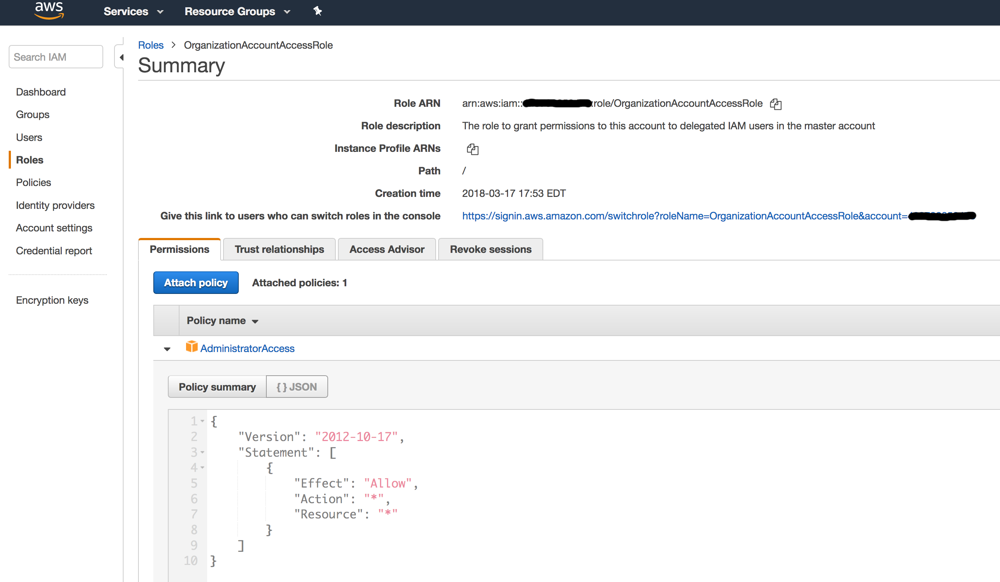

<!-- This file was automatically generated by the `build-harness`. Make all changes to `README.yaml` and run `make readme` to rebuild this file. -->

[](https://cloudposse.com)

# terraform-aws-organization-access-role

 [](https://travis-ci.org/cloudposse/terraform-aws-organization-access-role) [](https://github.com/cloudposse/terraform-aws-organization-access-role/releases/latest) [](https://slack.cloudposse.com)


Terraform module to create an IAM Role to grant permissions to delegated IAM users in the master account to access an invited member account

https://docs.aws.amazon.com/organizations/latest/userguide/orgs_manage_accounts_access.html


---

This project is part of our comprehensive ["SweetOps"](https://docs.cloudposse.com) approach towards DevOps. 


It's 100% Open Source and licensed under the [APACHE2](LICENSE).


## Screenshots



*Organization Account Access Role as Viewed from the AWS Web Console*


## Introduction

By default, when you create a member account as part of your Organization, AWS automatically creates `OrganizationAccountAccessRole` in the member account.

The role grants admin permissions to the member account to delegated IAM users in the master account.

However, member accounts that you invite to join your Organization do not automatically get the role created.

This module creates `OrganizationAccountAccessRole` role in an invited member account.

AWS recommends using the same name, `OrganizationAccountAccessRole`, for the created role for consistency and ease of remembering.

<br/>

## Usage

```hcl
module "organization_access_role" {
  source            = "git::https://github.com/cloudposse/terraform-aws-organization-access-role.git?ref=master"
  master_account_id = "XXXXXXXXXXXX"
  role_name         = "OrganizationAccountAccessRole"
  policy_arn        = "arn:aws:iam::aws:policy/AdministratorAccess"
```


After the role has been created in the invited member account, login to the master account and create the following policy:

(change `YYYYYYYYYYYY` to the ID of the invited member account)

```json
{
    "Version": "2012-10-17",
    "Statement": [
        {
            "Sid": "",
            "Effect": "Allow",
            "Action": [
                "sts:AssumeRole"
            ],
            "Resource": [
                "arn:aws:iam::YYYYYYYYYYYY:role/OrganizationAccountAccessRole"
            ]
        }
    ]
}
```


Then attach the policy to a master account Group that you want to delegate administration of the invited member account.

After that, users who are members of the Group in the master account will be able to assume the role and administer the invited member account by going here:

(change `YYYYYYYYYYYY` to the ID of the invited member account)

```
https://signin.aws.amazon.com/switchrole
                ?account=YYYYYYYYYYYY
                &roleName=OrganizationAccountAccessRole
                &displayName=Dev
```


__NOTE__: You can use [terraform-aws-organization-access-group](https://github.com/cloudposse/terraform-aws-organization-access-group) module
to create an IAM Group and Policy to grant permissions to delegated IAM users in the Organization's master account to access a member account.


## Makefile Targets
```
Available targets:

  help                                This help screen
  help/all                            Display help for all targets
  lint                                Lint terraform code

```

## Inputs

| Name | Description | Type | Default | Required |
|------|-------------|:----:|:-----:|:-----:|
| master_account_id | The ID of the master account to grant permissions to access the current account | string | - | yes |
| policy_arn | Policy ARN to attach to the role. By default it attaches `AdministratorAccess` managed policy to grant full access to AWS services and resources in the current account | string | `arn:aws:iam::aws:policy/AdministratorAccess` | no |
| role_name | The name of the role to grant permissions to delegated IAM users in the master account to the current account | string | `OrganizationAccountAccessRole` | no |

## Outputs

| Name | Description |
|------|-------------|
| role_arn | The Amazon Resource Name (ARN) specifying the role |
| role_id | The stable and unique string identifying the role |
| role_name | The name of the crated role |


## Related Projects

Check out these related projects.

- [terraform-aws-organization-access-group](https://github.com/cloudposse/terraform-aws-organization-access-group) - Terraform module to create an IAM Group and Policy to grant permissions to delegated IAM users in the Organization's master account to access a member account


## Help

**Got a question?**

File a GitHub [issue](https://github.com/cloudposse/terraform-aws-organization-access-role/issues), send us an [email][email] or join our [Slack Community][slack].

## Commerical Support

Work directly with our team of DevOps experts via email, slack, and video conferencing. 

We provide *commercial support* for all of our [Open Source][github] projects. As a *Dedicated Support* customer, you have access to our team of subject matter experts at a fraction of the cost of a fulltime engineer. 

[](mailto:hello@cloudposse.com)

- **Questions.** We'll use a Shared Slack channel between your team and ours.
- **Troubleshooting.** We'll help you triage why things aren't working.
- **Code Reviews.** We'll review your Pull Requests and provide constructive feedback.
- **Bug Fixes.** We'll rapidly work to fix any bugs in our projects.
- **Build New Terraform Modules.** We'll develop original modules to provision infrastructure.
- **Cloud Architecture.** We'll assist with your cloud strategy and design.
- **Implementation.** We'll provide hands on support to implement our reference architectures. 


## Community Forum

Get access to our [Open Source Community Forum][slack] on Slack. It's **FREE** to join for everyone! Our "SweetOps" community is where you get to talk with others who share a similar vision for how to rollout and manage infrastructure. This is the best place to talk shop, ask questions, solicit feedback, and work together as a community to build *sweet* infrastructure.

## Contributing

### Bug Reports & Feature Requests

Please use the [issue tracker](https://github.com/cloudposse/terraform-aws-organization-access-role/issues) to report any bugs or file feature requests.

### Developing

If you are interested in being a contributor and want to get involved in developing this project or [help out](https://github.com/orgs/cloudposse/projects/3) with our other projects, we would love to hear from you! Shoot us an [email](mailto:hello@cloudposse.com).

In general, PRs are welcome. We follow the typical "fork-and-pull" Git workflow.

 1. **Fork** the repo on GitHub
 2. **Clone** the project to your own machine
 3. **Commit** changes to your own branch
 4. **Push** your work back up to your fork
 5. Submit a **Pull Request** so that we can review your changes

**NOTE:** Be sure to merge the latest changes from "upstream" before making a pull request!


## Copyright

Copyright © 2017-2018 [Cloud Posse, LLC](https://cloudposse.com)


## License 

[](https://opensource.org/licenses/Apache-2.0) 

See [LICENSE](LICENSE) for full details.

    Licensed to the Apache Software Foundation (ASF) under one
    or more contributor license agreements.  See the NOTICE file
    distributed with this work for additional information
    regarding copyright ownership.  The ASF licenses this file
    to you under the Apache License, Version 2.0 (the
    "License"); you may not use this file except in compliance
    with the License.  You may obtain a copy of the License at

      https://www.apache.org/licenses/LICENSE-2.0

    Unless required by applicable law or agreed to in writing,
    software distributed under the License is distributed on an
    "AS IS" BASIS, WITHOUT WARRANTIES OR CONDITIONS OF ANY
    KIND, either express or implied.  See the License for the
    specific language governing permissions and limitations
    under the License.


## Trademarks

All other trademarks referenced herein are the property of their respective owners.

## About

This project is maintained and funded by [Cloud Posse, LLC][website]. Like it? Please let us know at <hello@cloudposse.com>

[](https://cloudposse.com)

We're a [DevOps Professional Services][hire] company based in Los Angeles, CA. We love [Open Source Software](https://github.com/cloudposse/)!

We offer paid support on all of our projects.  

Check out [our other projects][github], [apply for a job][jobs], or [hire us][hire] to help with your cloud strategy and implementation.

  [docs]: https://docs.cloudposse.com/
  [website]: https://cloudposse.com/
  [github]: https://github.com/cloudposse/
  [jobs]: https://cloudposse.com/jobs/
  [hire]: https://cloudposse.com/contact/
  [slack]: https://slack.cloudposse.com/
  [linkedin]: https://www.linkedin.com/company/cloudposse
  [twitter]: https://twitter.com/cloudposse/
  [email]: mailto:hello@cloudposse.com


### Contributors

|  [![Andriy Knysh][aknysh_avatar]][aknysh_homepage]<br/>[Andriy Knysh][aknysh_homepage] |
|---|

  [aknysh_homepage]: https://github.com/aknysh
  [aknysh_avatar]: https://github.com/aknysh.png?size=150


